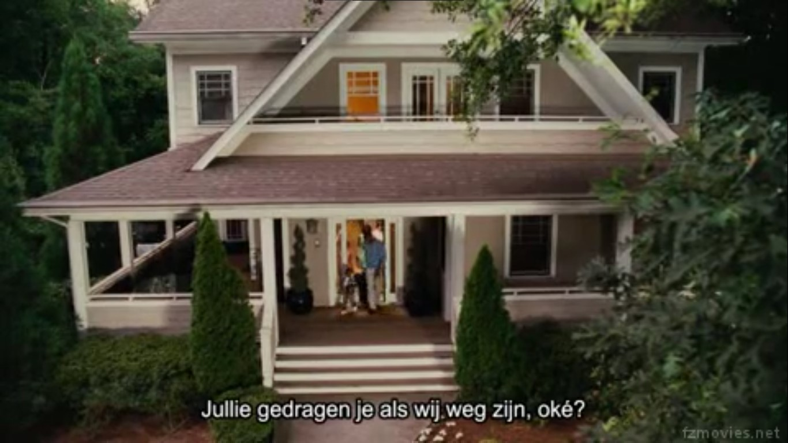

# FCB-DTA_Project-1
---
## Fashion Forward: Exploring Sustainable Practices in the Fashion Industry
---
### Project Outline
---
This project aims to investigate the current trends, challenges, and opportunities in sustainable fashion. The focus will be on understanding how the fashion industry can reduce its environmental impact, promote ethical labor practices, and create a circular economy.
### Objectives
---
- Analyze the Environmental Impact: Assess the environmental footprint of traditional vs. sustainable fashion practices.
- Explore Sustainable Materials: Identify and evaluate the use of sustainable materials and production methods.
- Understand Consumer Behavior: Investigate consumer attitudes and behaviors towards sustainable fashion.
- Evaluate Industry Practices: Study the initiatives and strategies employed by leading fashion brands to promote sustainability.
- Promote Awareness: Develop strategies to raise awareness and educate consumers about sustainable fashion.
### Tools Used
---
- Tableau
- Power BI
- Microsoft Excel for Data cleaning [Download here](https://www.microsoft.com/en-us/microsoft-365/excel)
  ~~~
  Google Query Sheet
  SELECT * FROM TABLE 1
  WHERE CONDITION = MET
  ~~~

|Heading 1 | Heading 2 | Heading 3|
|----------|-----------|----------|
|Data 1 | Data 2 | Data 3|

